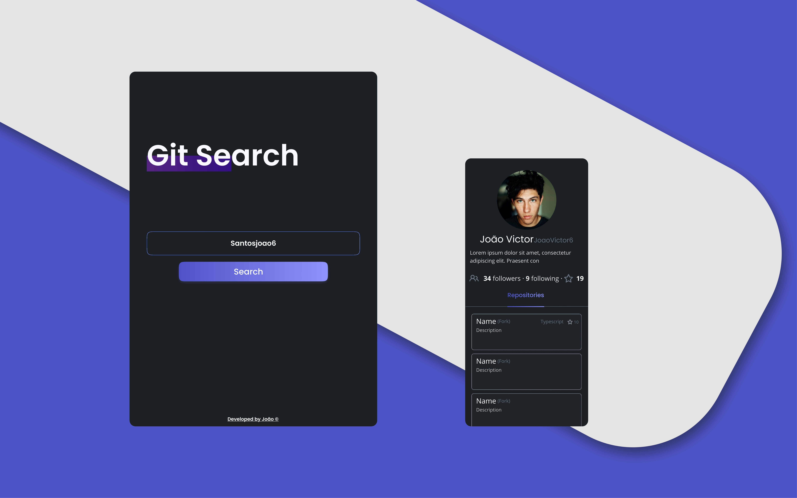

# Git search

  

## Tecnologias 🤖
- [NextJS](https://nextjs.org/)
- [Styled components 💅🏾](https://styled-components.com/)

## Como usar
Hospedei o projeto na vercel, acredito que seja o mais indicado apra projetos com nextJS.
[Link do web app ](https://github-profile-view.vercel.app/)
## Sobre o projeto 💡

Acredito que um app onde consumimos a API do github é como um clássico para todos os estudantes de frontend. Contudo, já tinha um projeto com está idéia, porém estava me incomodando tal projeto. Acredito que evoluí bastante desde então e refiz.

## Dificuldades
Quanto mais uso styled-components nos projetos mais aprendo. Usar as vantagens do typescript junto desta lib mesmo de uma maneira não tão correta, facilita demais o desenvolvimento. Entender também como mesclar as vantagens de um CSS dentro do javascript(nesse caso, typescript) faz total diferença.

Tambem achei muito interessante trabalhar com query params usando nextJS, tive que ler um pouco e buscar alternativas para ter uma certa persistencia dos parametros e acredito que isso me fez ter mais entendimento sobre o NextJS.

## Conclusão
Foi uma ótima experiência e um grande aprendizado esse projeto. Aplicar responsividades, animações e o uso da API nativa Intersection Observer foi muito legal.